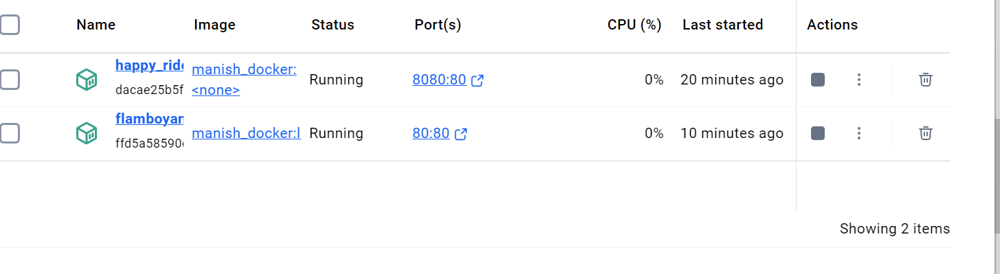
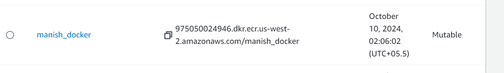
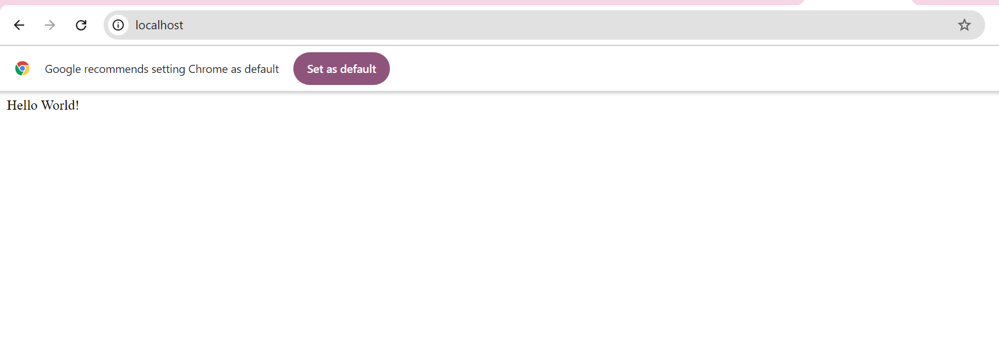

# Dockerized Nginx Web Server
This project sets up a basic Nginx web server using Docker to serve a simple HTML page. The web server is containerized with Docker, built with a custom nginx.conf file, and pushed to AWS Elastic Container Registry (ECR).

# Project Overview
This project demonstrates how to:

Serve a basic HTML page using Nginx.
Build a Docker container that serves the HTML page using Nginx.
Push the Docker image to Amazon Elastic Container Registry (ECR).

# Files in the Repository
index.html: Contains the basic HTML page with the content "Hello,World!".
nginx.conf: Custom Nginx configuration file that sets up Nginx to serve the index.html page on port 80.
Dockerfile: Instructions for building the Docker image, using the official Nginx base image, copying the necessary files, and setting up the web server.


# Prerequisites
Before start, ensure have the following:

Docker installed on local machine.
Docker Installation Guide
AWS CLI configured with appropriate permissions to push to ECR.
AWS CLI Installation Guide
AWS Account with permissions to create an ECR repository.

# Building and Running the Docker Container
1. Created a Basic HTML Page (index.html)
2. Created the Nginx Configuration (nginx.conf)
3. Created the Dockerfile
4. Built the Docker Image
In the same directory as the Dockerfile, ran the following command to build the Docker image:
```docker build -t manish_docker .```

5.Ran the Docker Container
Ran the Docker container and mapped port 80 of the container to port 80 on local machine:
```docker run -d -p 80:80 manish_docker```
6. Pushing the Image to AWS ECR
Create an ECR Repository
1. Went to AWS Console:
  1.Navigated to Elastic Container Registry (ECR).
  2.Created a new public repository and noted the repository URI.
2. Authenticated Docker to ECR Repository
   Ran the following command to authenticate Docker to ECR:
```aws ecr get-login-password --region us-west-2 | docker login --username AWS --password-stdin 975050024946.dkr.ecr.us-west-2.amazonaws.com```
3. Tagged the Docker Image
Tagged Docker image with the ECR repository URI:
```docker tag manish_docker:latest 975050024946.dkr.ecr.us-west-2.amazonaws.com/manish_docker:latest```
4. Push the Docker Image to ECR
Pushed Docker image to the ECR repository:
```docker push 975050024946.dkr.ecr.us-west-2.amazonaws.com/manish_docker:latest```


# Conclusion

Built a Docker container running Nginx to serve a simple HTML page.
Pushed the Docker image to AWS ECR for public access.




  
